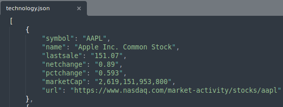
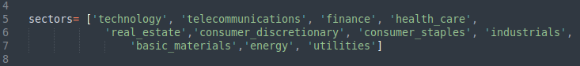

# Extract Nasdaq Stocks
###### Simple script that extracts data from Nasdaq and export it on csv and json files 
###### By default, It gets the first 5 stocks with the highest market capital for each sector
#
##### Source:   
###### WEB: https://www.nasdaq.com/market-activity/stocks/screener 
###### API: https://api.nasdaq.com/api/screener/stocks
##### Usage:
###### Data sample:

###### Change the numbers of stocks by sector editing the "limit" field in "params" dictionary:

###### Change the number of sectors editing the "sectors" list:

